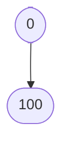

# Guessing.md
## **The Guessing game**
Players will choose a random number to guess and the computer randomly selects a number within a specified range, and the user guesses the number. Theapplication provides feedback based on the user's input whether their guess was too high,too low, or correct.

